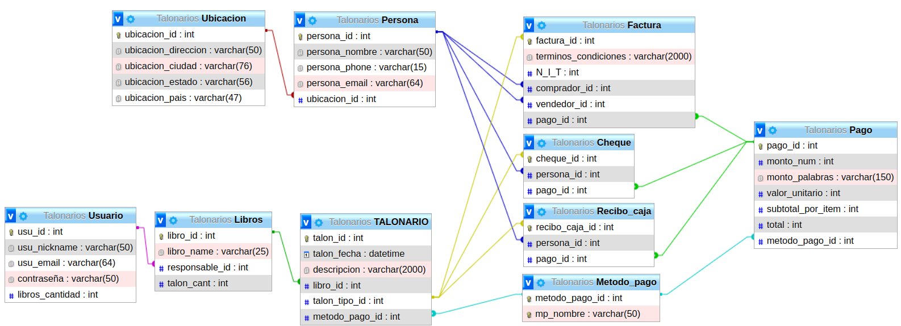
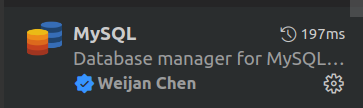
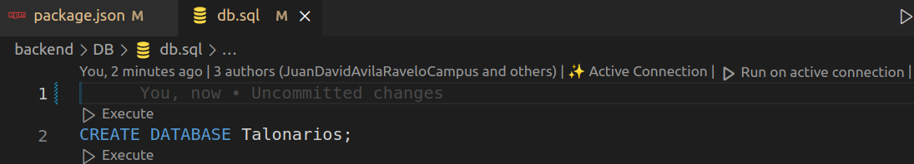
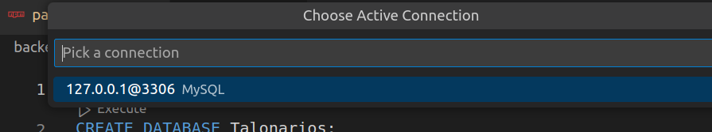
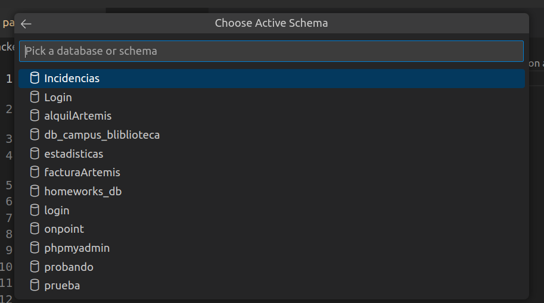
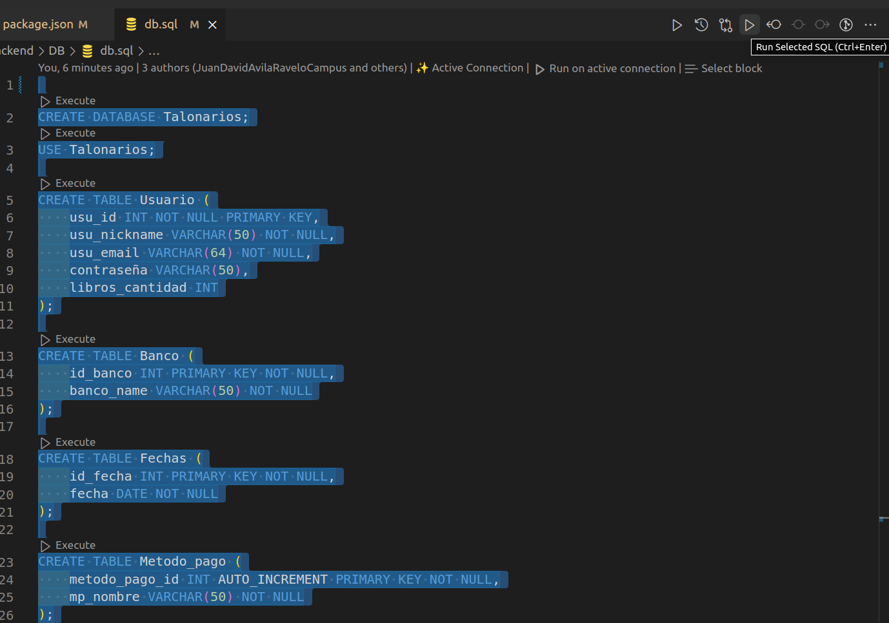
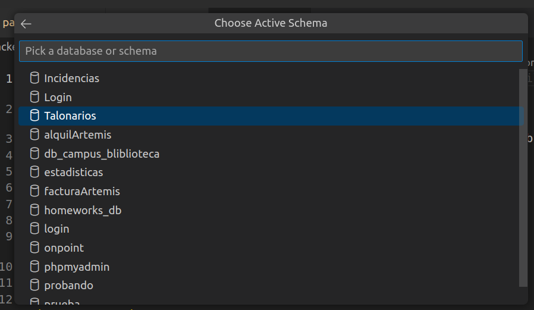
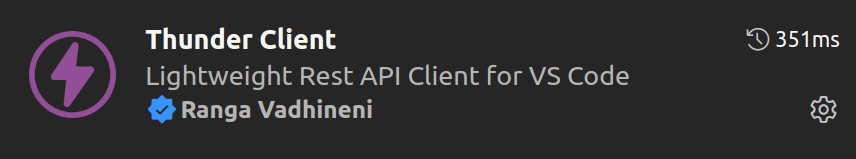
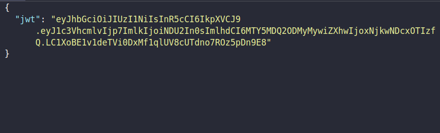
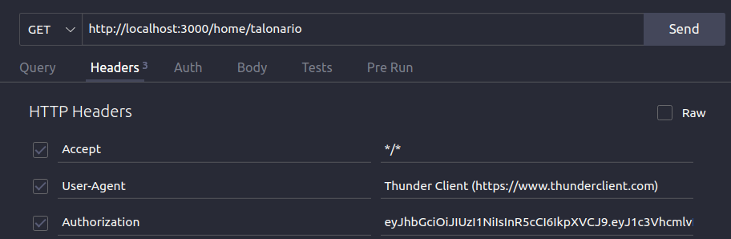

# CloudCheckbooks - Simplifica tu contabilidad en la nube 📚💻

¡Bienvenidos a CloudCheckbooks! La solución definitiva para simplificar la administración de documentos y papeleo contable. Con CloudCheckbooks, podrás decir adiós a los talonarios físicos y llevar todo tu papeleo al mundo virtual de forma rápida y segura. 🎉

## ¿Qué es CloudCheckbooks? 🤔💡

CloudCheckbooks es una plataforma que te permite crear y almacenar tus "cuadernillos" o "libros" contables en la nube, sin necesidad de lidiar con documentos impresos. Olvídate de las firmas en papel, ahora podrás firmar y editar de manera virtual, ahorrando tiempo y recursos. 💻✏️

## Objetivos 🎯🚀

- Facilitar la gestión y almacenamiento de documentos contables de manera virtual.
- Eliminar el uso de papeleo y firmas en papel, ofreciendo opciones de firma y edición totalmente digitales.
- Ofrecer acceso remoto a los documentos desde cualquier lugar y en cualquier momento.
- Agilizar la emisión de facturas, recibos, órdenes de compra y cheques sin la necesidad de impresiones **(por ser la primera versión de este programa, solo estarán disponibles las opciones de facturas, recibos y cheques).**
- Generar archivos imprimibles para aquellos casos que lo requieran, manteniendo la flexibilidad y comodidad para el usuario. 🖨️

## Ventajas de CloudCheckbooks ✅🌟

- Acceso remoto a tus documentos desde cualquier lugar 🌐
- Firma y edición virtual, sin necesidad de papel ✏️🖱️
- Gestiona tu contabilidad de forma rápida y eficiente 📈
- Emitir facturas, recibos, órdenes de compra y cheques sin papeleo 📝🧾✅

# Mas info ℹ️

Este es un archivo README.md para proporcionar información adicional sobre la implementación del proyecto "CloudCheckbooks" en la nube ☁️. Aquí encontrarás detalles sobre las tecnologías utilizadas en el desarrollo del proyecto, las dependencias requeridas y otros temas relacionados con la contabilidad en línea. 📝💻

## Tecnologías utilizadas 🛠️

- **Node.js**: Para el desarrollo del backend y la creación de API REST.
- **Express.js**: Framework de Node.js para la creación de servidores web.
- **MySQL**: Base de datos relacional para almacenar los documentos contables de forma estructurada. 🗃️

## Dependencias utlizadas 📋🔍

- class-transformer
- class-validator
- dotenv
- express
- jose
- mysql2
- nodemon
- promise-mysql
- reflect-metadata
- typescript

## Proyección básica de la base de datos 📋🔍



Definición de la construcción de la base de datos según la importancia de las tablas y las relaciones que tenían entre sí.

| TABLA       | DEFINICION                                                   |
| ----------- | ------------------------------------------------------------ |
| Usuario     | Un usuario puede tener muchos libros                         |
| Libros      | Un libro puede tener muchos talones                          |
| Talonario   | Puede tener solo uno de los 3 tipos de talón registrado      |
| Persona     | Una persona puede representar varios talones                 |
| Ubicacion   | Varias personas pueden estar ubicadas en el mismo lugar      |
| talon_tipo  | Factura, cheque o recibo de caja, cada uno puede pertenecer a muchos talones |
| Metodo_pago | Define la forma de pago y según su validación                |
| Pago        | Se define según la forma de pago                             |

# Manual de uso 📖🚀 

## Instalación 🛠️🚀

1. Clona este repositorio en tu computadora.

```bash
git clone https://github.com/JuanDavidAvilaRaveloCampus/CloudCheckbooks.git
```

2. Instala las dependencias necesarias para el frontend y el backend.

Para ello, primero debemos ubicarnos en la carpeta "backend" con el comando:

```bash
cd ./backend
```

3. Ahora, instalamos las dependencias:

```bash
npm update
```

4. Crea el archivo controllers con el siguiente comando:

```bash
npm run tsc
```

Luego procedemos a dar de baja el servicio con **CTRL + C.**

5. **Configura las variables de entorno.**

Crea un archivo `.env` en la carpeta "backend" y agrega las siguientes variables de entorno:

```bash
touch .env           
```

Dentro de ese archivo ingresar el siguiente script.

```json
SERVER_CONFIG={"hostname": "localhost", "port": 3000}
DB_CONFIG={"host":"localhost","database":"Talonarios","user":"AQUÍ_VA_TU_USUARIO","password":"AQUÍ_VA_TU_CONTRASEÑA_DE_MYSQL", "port": 3306}
JWT_PRIVATE_KEY = "Miguel, porfa, dejeme dormir hoy todo bien :')"
```

Ingresar tu usuario de la base de datos en **"AQUÍ_VA_TU_USUARIO"** y tu constraseña en **"AQUÍ__VA_TU_CONTRASEÑA_DE_MYSQL"**

Ejemplo:

```json
SERVER_CONFIG={"hostname": "localhost", "port": 3000}
DB_CONFIG={"host":"localhost","database":"Talonarios","user":"campus","password":"campus2023", "port": 3306}
JWT_PRIVATE_KEY = "Miguel, porfa, dejeme dormir hoy todo bien :')"
```


## 🏃‍♂️ **Correr la base de datos** 🏃‍♀️

1. **Iniciar la base de datos**

   Ubicate en la carpeta que almacena la base de datos `DB`

   Abre el archivo `db.sql` para configurar la conexión con la  base de datos desde Visual Studio Code. Asegúrate de tener instalada la  extensión MySQL para ello.


1. Activar la coneccion por medio del visual estudio code. Para ello primero Instalar la extension MySQL

   

2. Habiendo hecho esto, nos aparecerá la opción de connección sobre nuestro código de la siguiente forma

   

3. Darle click en activar conexión y nos aparecerá una ventana similar a la siguiente: 

   

4. Seleccionar la opción que te aparezca

5. Seleccionar en cualquier base de datos que tengas ya instalada o preinstalada

   

6. ¡Listo! Ahora tu base de datos está configurada y lista para usar. 🚀🌟

   

### Crear la base de datos

Estando ubicados en el archivo `db.sql` seleccionaremos todo y ejecutarémos el código

Para ejecutarlo daramemos click en la opción que aparece en la imagen



Teniendo ya creada nuesta base de datos, es hora de insertarle algunos "datos":

1. Para ello vamos al archivo `insert.sql` como en el archivo anterior, también activaremos la connexión, sin embargo en esta ocación, seleccionaremos el nombre de nuesta base de datos, la cual es `Talonarios`

   

2. Habiendo hecho esto, seleccionaremos todo y correremos el código.


# Iniciar el servidor:

1. Inicia el servidor backend y la validación de TypeScript para correr el backend.

Dentro de la carpeta "**backend**", ejecuta el siguiente comando:

```bash
npm run dev
```

Crea una nueva terminal y ejecuta este otro comando:

Si te llega a salir error, asegúrate de estar en la carpeta **backend** 

```bash
npm run tsc
```

2. Accede a la ruta impresa en la terminal.

La aplicación estará disponible en `http://localhost:3000`.

Puedes acceder al directorio desde `http://localhost:3000/home`


### ⚠️ **ADVERTENCIA:** Para usar la API, primero debes obtener un token de verificación. 🔒🔑


### Herramientas para acceder a la API:

Por motivos prácticos utilizaremos las siguientes herramientas


- Thunder Client: Extención de visual estudio code




### Pasos a tener en cuenta para generar el token:

1. Hacer una peticion a la URL proporcionada por el servidor, agregar el `/token/:id` , donde **:id** será cualquier valor numérico que le asignemos.

   Ejemplo:

   ```url
   http://localhost:3000/validate/777/Juan
   ```

2. Una vez hecho esto, se generará un token:

   - Copiar el **token**

     

3. Acceso:

   1. Crear un nuevo parámetro el cual será un **Header** cuyo nombre **extrictamente** y para el funcionamiento de la api será **Authorization** 

   2. Agregar como valor el token generado **(SIN COMMILLAS)**

      1. Hacer una peticion por metodo **GET** a la url que desea acceder según las rutas especificadas, por ejemplo **/home/talonarios**

   3. Darle en send

      

      Listo, con esto ya tendrás tu **token** y sabrás usarlo :wink:

      


## ROUTES 🔍🛣️

Aquí encontrarás las rutas de acceso a diferentes secciones:

- Factura: http://localhost:3000/home


## Contribuciones y Licencia 📝📄

¡Agradecemos tus contribuciones al proyecto! Si deseas colaborar, sigue los siguientes pasos:

1. Crea un nuevo "branch" para tus cambios.

```bash
git checkout -b mi-nueva-funcionalidad
```

2. Realiza tus modificaciones y mejoras.

3. Haz un "commit" de tus cambios.

```bash
git commit -m "Agrego nueva funcionalidad"
```

4. Envía tus cambios al repositorio remoto.

```bash
git push origin mi-nueva-funcionalidad
```

5. Abre un "Pull Request" en GitHub para que revisemos tus cambios.

Este proyecto se encuentra bajo la Licencia MIT. Siéntete libre de utilizar, modificar y distribuir el código según tus necesidades.

¡Gracias por contribuir al proyecto "CloudCheckbooks"! 🙌💰|
