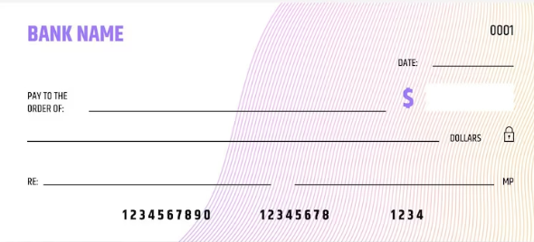
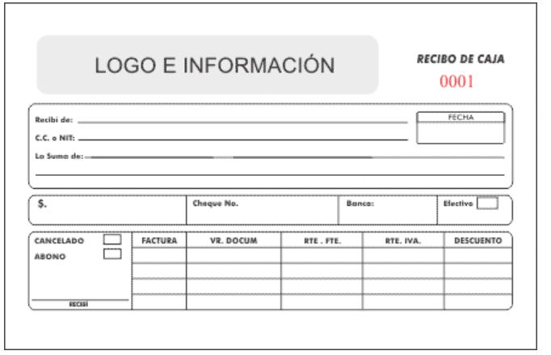
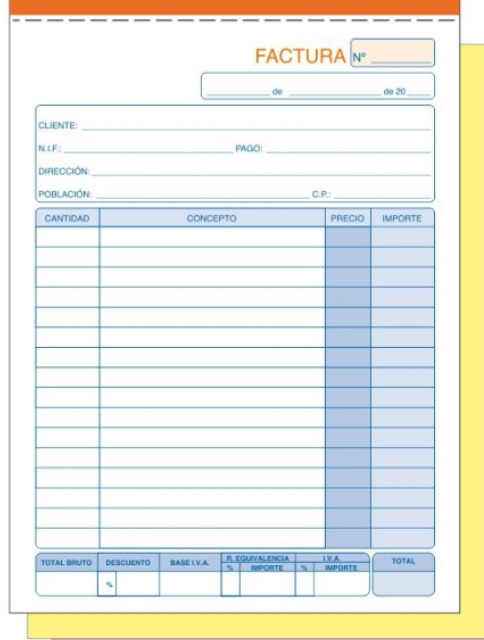

# Talonario Online

Herramienta que proporciona al usuario una plantilla para crear y almacenar sus "cuadernillos" del tipo que requieran en la nube. Más específicamente serán denominados "libros" los cuales almacenarán el mismo tipo de "cuadernillo" que se requiera; además de ello, se implementará la opción de firma y edición totalmente virtual, dado el caso que no se pueda o no se tengan los recursos para llevar a cabo dicha firma, existirá una opción para poder imprimirlo donde necesites, la cual te generará un archivo PDF que podrás llevar contigo donde necesites. 

**Nota:** Por motivos de seguridad se tendrá un registro y login (detalles que posiblemente se implementarán en futuras versiones del proyecto, no se afirma ni se niega lo dicho)

**OBJETIVO**:  Facilitar la tarea de firmar y almacenar talones (cheques) de forma dinámica, intuitiva y remota.

**Función**: 

- Crear y editar inputs
- Descargar archivos tipo PDF o EXCEL
- 

**Plantillas de referencia de talonarios:**

- Cheques (principal)

  

- Caja / Recibo de caja 

  

- Talonario de facturas

    