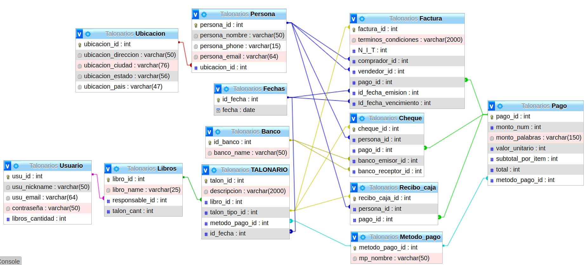

# **TALONARIO ONLINE**

Herramienta que permite a los usuarios crear y almacenar cuadernillos personalizados en la nube. Estos cuadernillos, llamados "libros", almacenan diferentes tipos de contenido según las necesidades. La plataforma también ofrece una opción de firma y edición virtual para aquellos casos en los que no se puedan llevar a cabo de manera física. Además, se brinda la opción de generar un archivo PDF imprimible para su conveniencia.

## **Objetivo**: 

- Simplifica el proceso de firmar y almacenar talones de forma eficiente y remota . 
- Proporciona una herramienta en línea que permite a los usuarios crear y guardar cuadernillos virtuales, llamados "libros", con la capacidad de firmar y editar de manera virtual. 
- Ofrece la opción de generar un archivo PDF imprimible para situaciones donde se requiera una copia física. 
- Solución dinámica, intuitiva y remota para la firma y almacenamiento de talones.

**PosData:** Aunque actualmente no se ha implementado el registro y el inicio de sesión, se considerará en futuras versiones del proyecto

### **Referencia de talonarios:**

- Cheques (principal)

- Caja / Recibo de caja 

- Talonario de facturas

## **PROYECCIÓN DE LA BASE DE DATOS:**

