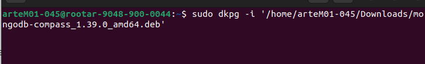
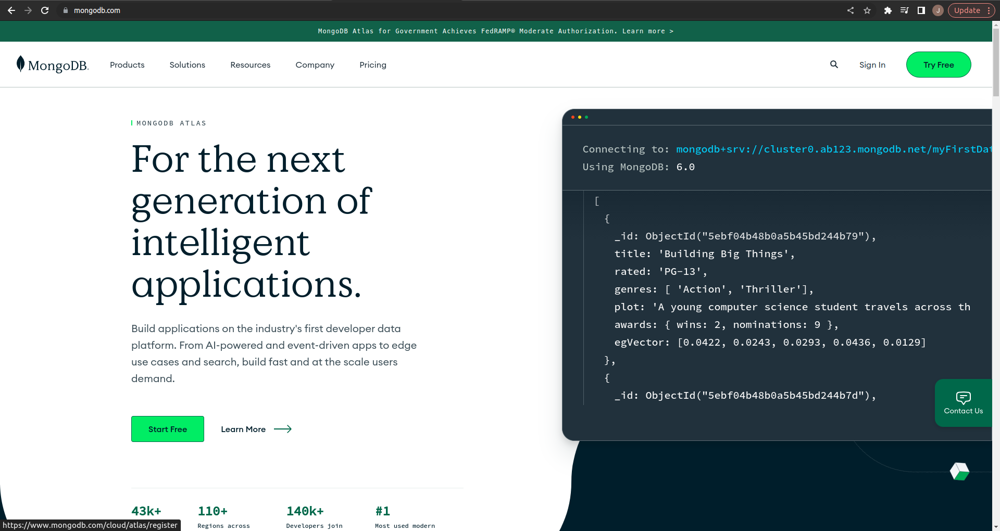
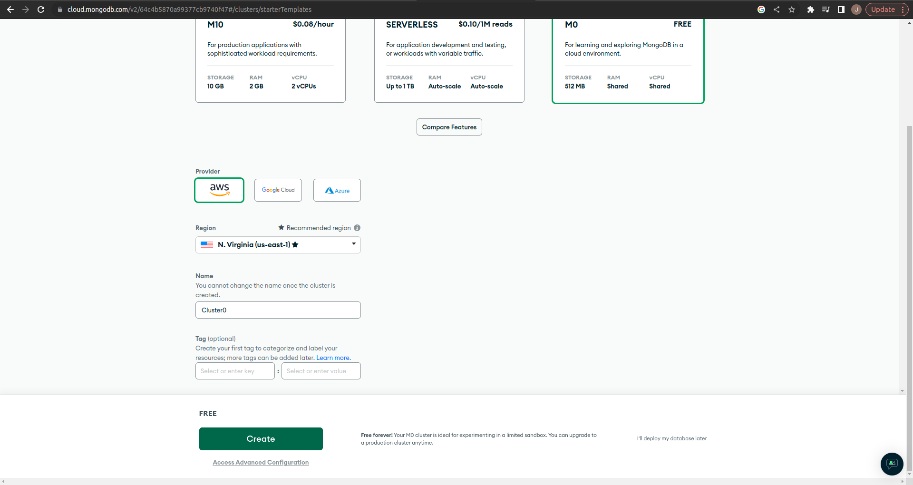
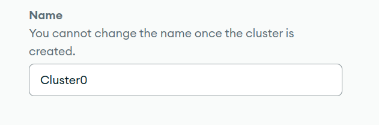
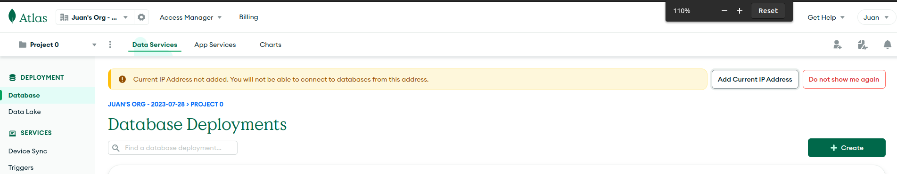
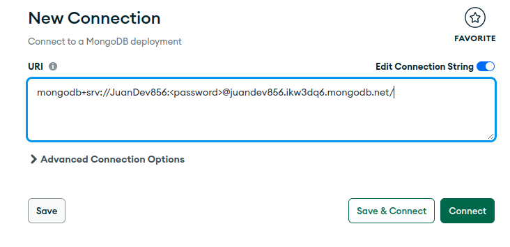
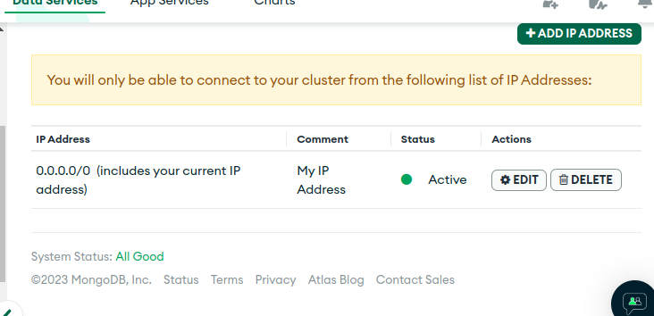

# MongoDB:leaves:

MongoDB es un gestor de bases de datos no relacionales o **NoSQL** orientado a documentos, utilizado para almacenar volúmenes masivos de datos. A diferencia de las bases de datos tradicionales basadas en SQL, MongoDB no se basa en tablas y columnas. 📚🌐

## BJSON Y JSON  :memo:

BJSON (Binary JSON) es una extensión binaria de los archivos JSON. BSON también es una notación de objetos con estructura similar de pares clave-valor. Sin embargo, representa los datos en una forma binaria, lo que lo hace más eficiente para su almacenamiento y transferencia. BSON es ampliamente utilizado en bases de datos NoSQL, como MongoDB, para almacenar y recuperar datos de forma rápida y eficiente. A diferencia de JSON, BSON es binario y no legible por humanos, pero esto lo hace más adecuado para aplicaciones que requieren un alto rendimiento y un menor uso de recursos.

En resumen, JSON es una representación de datos legible por humanos y ampliamente utilizado en aplicaciones web y API's, mientras que BSON es una extensión binaria de JSON utilizada principalmente en bases de datos NoSQL para un almacenamiento eficiente.

<hr>

# Menú:books:

- [Manual de instalación 🛠️](#manual-de-instalación)
  - [Instalación de **MongoDB** :wrench:](#instalación-de-mongodb)
  - [Correr **MongoDB** :herb:](#correr-mongodb)
  - [Desinstalación de **MongoDB** 🗑️🚀](#desinstalación-de-mongodb)

- [Instalación de **MongoDB Compass** 🔩](#instalación-de-mongodb-compass)
  - [Corrección de error de conexión con MongoDB Compass :bug:🔧](#corrección-de-error-de-conexión-con-mongodb-compass)

- [Atlas 💡](#atlas)
  - [Creación de cuenta en Atlas :star::rocket:](#creación-de-cuenta-en-atlas)

- [Creación de la base de la base de datos](#creación-de-la-base-de-la-base-de-datos)
- [Conexión de tu cuenta Atlas con MongoDB Compass 🧭](#conexión-de-tu-cuenta-atlas-con-mongodb-compass)


<hr>

# Manual de instalación

Herramientas a instalar:

- MongoDB Shell
- MongoDB Compass

### Instalación de MongoDB

1. **Descargar MongoDB:** Ve al sitio web oficial de [MongoDB](https://www.mongodb.com/docs/manual/installation/) y descarga la versión adecuada para tu sistema operativo. 📥💻. Ten en cuenta que las versiones oficiales (**Enterprise Edition**) son versiones que tienen soporte técnico proporcionado por el equipo de MongoDB y otras características, sin embargo, es de pago. La otra opción es la versión de la comunidad (**Community Edition**), que son versiones de código abierto con características y funcionalidades básicas, pero no ofrecen un soporte oficial por parte de MongoDB, aunque la comunidad puede brindar ayuda.

2. **Instalar MongoDB:** Sigue las instrucciones de instalación proporcionadas en el sitio web para instalar MongoDB en tu sistema. 🔧🚀

3. **Configurar MongoDB:** Una vez instalado, es posible que debas configurar ciertos parámetros, como la ruta de almacenamiento de datos o el puerto de escucha. Puedes encontrar información detallada sobre la configuración en la documentación oficial de MongoDB. 📄⚙️

4. **Iniciar el servidor:** Para iniciar el servidor de MongoDB, abre una terminal o línea de comandos y ejecuta el comando adecuado para tu sistema operativo. Por lo general, el comando es **"mongod"** o **"mongod.exe"**. 🚀🖥️

5. **Interactuar con MongoDB:** Una vez que el servidor esté en funcionamiento, puedes interactuar con MongoDB a través de la línea de comandos o mediante herramientas de interfaz gráfica como **MongoDB Compass**. 💻🔍

¡Listo! Ahora tienes MongoDB instalado y listo para ser utilizado en tu sistema. 🎉🚀

Si quieres saltarte toda la documentación, copia y pega los siguientes comandos en la terminal:

**Nota:** Los siguientes comandos solo aplican para el sistema operativo Ubuntu 22.04 LTS

1. **Importar la clave pública utilizada por el sistema de gestión de paquetes**.

   ```bash
   sudo apt-get install gnupg curl
   ```

   ```bash
   curl -fsSL https://pgp.mongodb.com/server-6.0.asc | \
      sudo gpg -o /usr/share/keyrings/mongodb-server-6.0.gpg \
      --dearmor
   ```

2. **Crear un archivo de lista para MongoDB**

   ```bash
   sudo touch /etc/apt/sources.list.d/mongodb-org-6.0.list
   ```

   ```bash
   echo "deb [ arch=amd64,arm64 signed-by=/usr/share/keyrings/mongodb-server-6.0.gpg ] https://repo.mongodb.org/apt/ubuntu jammy/mongodb-org/6.0 multiverse" | sudo tee /etc/apt/sources.list.d/mongodb-org-6.0.list
   ```

3. **Recargar bases de datos de paquetes locales**

   ```bash
   sudo apt-get update
   ```

4. **Instalar los paquetes de MongoDB**

   ```bash
   sudo apt-get install -y mongodb-org
   ```

   ```bash
   echo "mongodb-org hold" | sudo dpkg --set-selections
   echo "mongodb-org-database hold" | sudo dpkg --set-selections
   echo "mongodb-org-server hold" | sudo dpkg --set-selections
   echo "mongodb-mongosh hold" | sudo dpkg --set-selections
   echo "mongodb-org-mongos hold" | sudo dpkg --set-selections
   echo "mongodb-org-tools hold" | sudo dpkg --set-selections
   ```

#### Correr MongoDB

1. **Iniciar MongoDB**

   ```bash
   sudo systemctl start mongod
   ```

   ```bash
   sudo systemctl daemon-reload
   ```

2. **Verificar que MongoDB fue correctamente instalado.**

   ```bash
   sudo systemctl status mongod
   ```

   ```bash
   sudo systemctl enable mongod
   ```

3. **Detener MongoDB**

   ```bash
   sudo systemctl enable mongod
   ```

4. **Recargar MongoDB**

   ```bash
   sudo

 systemctl restart mongod
```

5. **Empezar a usar MongoDB**

   ```bash
   mongosh
```

### Desinstalación de MongoDB

1. **Detener MongoDB**

   ```bash
   sudo service mongod stop
   ```

2. **Remover Paquetes**

   ```bash
   sudo apt-get purge mongodb-org*
   ```

3. **Remover los directorios de datos**

   ```bash
   sudo rm -r /var/log/mongodb
   sudo rm -r /var/lib/mongodb
   ```

## Instalación de **MongoDB Compass**

1. Accede al siguiente enlace: [MongoDB Compass](https://www.mongodb.com/products/compass)

2. Elige la última versión estable disponible.

3. En "Plataforma", selecciona la opción que corresponda a tu sistema operativo.

4. Descarga la aplicación.

5. Una vez descargado el archivo, accede a la carpeta de "Descargas" y arrastra el archivo recién descargado a la terminal para conocer la ruta del archivo.

6. En la terminal, ingresa el siguiente comando (**esto solo aplica para Ubuntu, para otros sistemas operativos consulta la documentación oficial**):

   ```bash
   sudo dpkg -i <nombre_del_archivo.deb>
   ```

   Debe verse de la siguiente forma:

   

7. Si el comando anterior muestra un error, ejecuta los siguientes comandos en orden:

   ```bash
   sudo apt --fix-broken install
   ```

   Este comando buscará las pre-dependencias necesarias para que la instalación sea exitosa.

   Luego, repite el paso 6.

¡Listo! Ahora has instalado **MongoDB Compass**.

### Corrección de error de conexión con MongoDB Compass 

Si llegado el caso ocurre el siguiente error al darle click en **Connect** y la conexión es rechazada, sigue estos pasos:

1. **Verifica la conexión**:

   ```bash
   service mongod status
   ```

2. **Activa la conexión**:

   ```bash
   sudo systemctl start mongod
   ```

3. **Vuelve al paso 1**. Si la conexión funciona, ¡felicidades! Si no, busca en la [documentación oficial de MongoDB](https://docs.mongodb.com/) o en la comunidad para obtener más ayuda. 🛠️🚀

<hr>

# Atlas

Atlas es un servicio de base de datos en la nube. Permite alojar y administrar bases de datos sin la necesidad de configurar y mantener la infraestructura de servidores.

### Características ✨🌱

- Facilidad de uso

- Escalabilidad

- Alta disponibilidad 

- Seguridad

- Localizaciones globales

- Integraciones

- Automatización

- Tarificación flexible

  

## Creación de cuenta en Atlas

Pasos a seguir:

1. Acceder a la página oficial: [MongoDB](https://www.mongodb.com/) 
2. Darle click a **Start Free** o **Try Free** para crear la cuenta, esto te redireccionará a la página de registro. 🌟🚀



3. Llenar el formulario o crear la cuenta por medio de Google y seguir los pasos que se muestren en pantalla.
4. Seleccionar la opción **Free**, llenar el formulario y crear tu cuenta. 📄💡



Ten en cuenta que al asignar el nombre del grupo **"Cluster"** no se podrá cambiar. 

5. Asigna tu usuario y contraseña. Ten en cuenta que esta contraseña debe ser fácil de recordar. 🔑🤔

6. Click en **Create User**.
7. Click en **Finish and Close**. 🎉🔐

¡Felicidades! Ya tienes tu cuenta de MongoDB, ahora puedes acceder a ella desde el navegador o desde tu aplicación MongoDB Compass. 🌐💻

<hr>


# Creación de la base de la base de datos

1. Ir a la página oficial

2. Iniciar seción con **Atlas**

3. Click en el logo de atlas

   

4. Click en **New Proyect**

5. Asignamos el nombre del proyecto y damos click en **next**

6. Es opcionar agregar permisos para miembros, pero para este ejemplo, nos saltaremos ese paso dandole click en **Create Proyect**

7. Click en **Build a Database**

8. Seleccionamos el proveedor y la región a gusto

9. Nombramos nuestro **Cluster**. 

   **NOTA:** No se puee cambiar el nombre del grupo luego de ser creado

10. Click en **Create**

11. Asignamos un nombre y contraseña

12. Click en **Create User**

13. Click en **Finish and Close**

14. Click en **Go to DataBases**

Listo tu Base de datos fué instalada correctamente

Para conectarte desde tu **MongoDB Compass** realizaremos de nuevo el paso de [Connexión](#conexión-de-tu-cuenta-atlas-con-mongodb-compass)


## Conexión de tu cuenta Atlas con MongoDB Compass

1. En tu navegador, inicia sesión con tu cuenta Atlas en la página oficial de MongoDB.

2. Accede a la opción Database. 

3. Accede a la opción de Compass.

   

4. Selecciona todas las opciones que cumplan tus parámetros y sigue los pasos.

5. Copia el punto 2 de la siguiente imagen:

   

6. Pega el punto 3 en la aplicación de **MongoDB Compass**. 
7. Cambia **<password>** por tu contraseña.
8. **Opcional:** Darle click en **FAVORITE** y asignarle un color
9. Activa la conexión dándole click en **Connect**.


### Llegado el caso de que ocurra algún error de conexión realizar los siguientes pasos: 

1. Ubícate en el navbar lateral e ve a las opciones de seguridad (**Security**).

2. Click en **Network Access**.

3. Click en **EDIT**.: El obejtivo de este paso es darle permiso a todas la ip para que tengan acceso a la base de datos siempre

    

4. Click en **ADD CURRENT IIP ADDRESS** 😄


